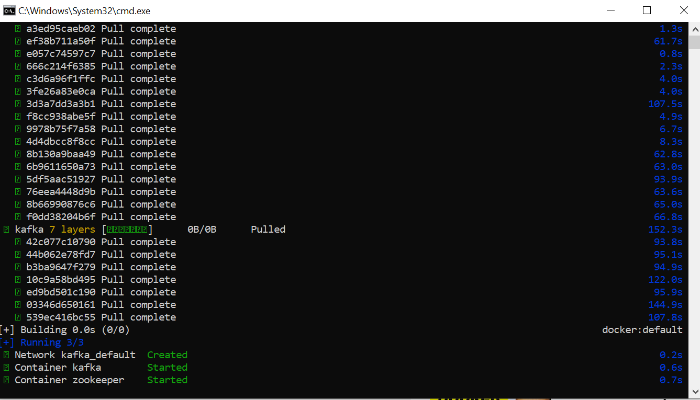
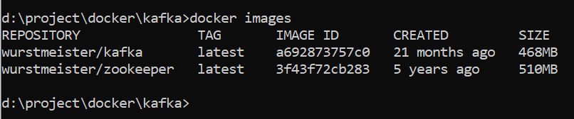
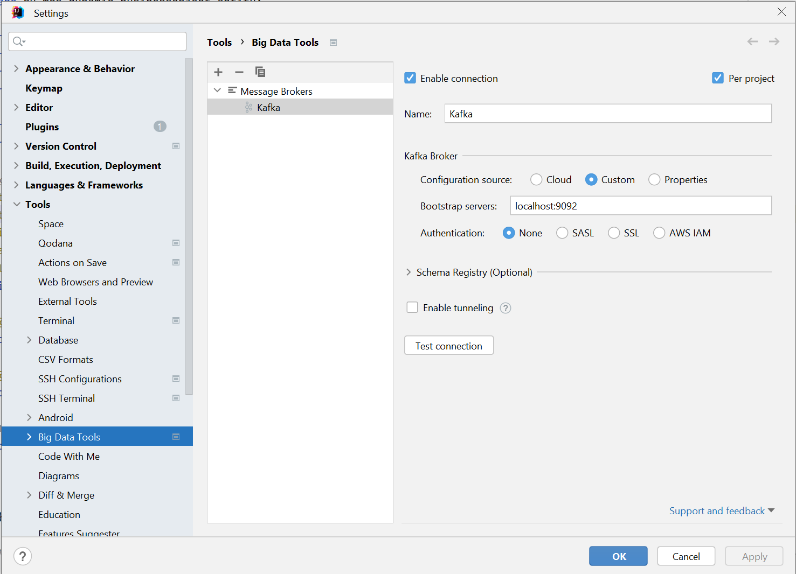
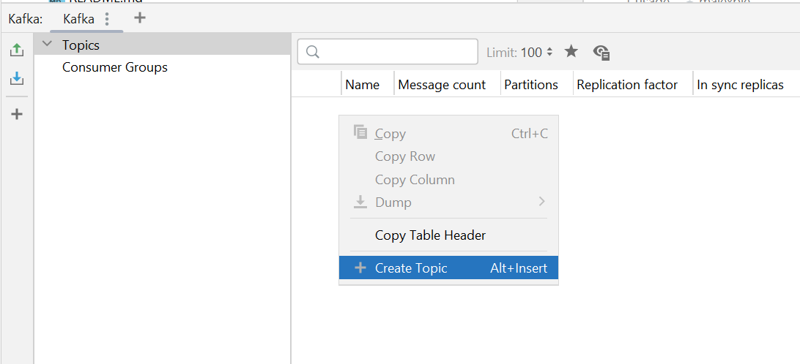
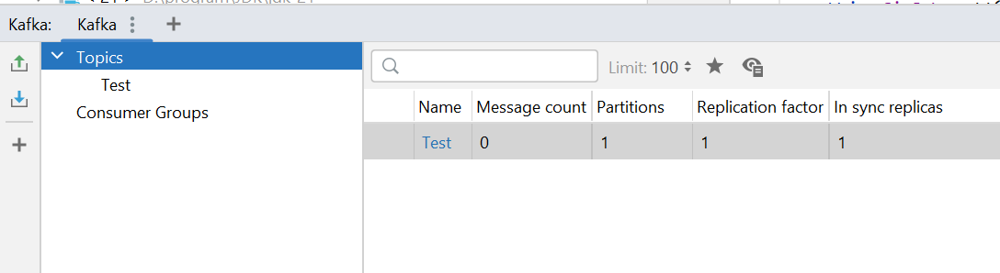

## Run docker compose

```bash
docker compose -f docker-compose.yml up -d
```





## Run console in docker container
```bash
docker exec -it kafka /bin/sh
```

## Using kafka

1. Run Intellij Idea and add configuration

   

2. Create topic

   

   

### Create Kafka topic

```
kafka-topics.sh --create --zookeeper zookeeper:2181 --replication-factor 1 --partitions 1 --topic quickstart
```

### Start Producer app (CLI)

```
kafka-console-producer.sh --topic quickstart --bootstrap-server localhost:9092
```

### Start consumer app (CLI)

```
kafka-console-consumer.sh --topic quickstart --from-beginning --bootstrap-server localhost:9092
```